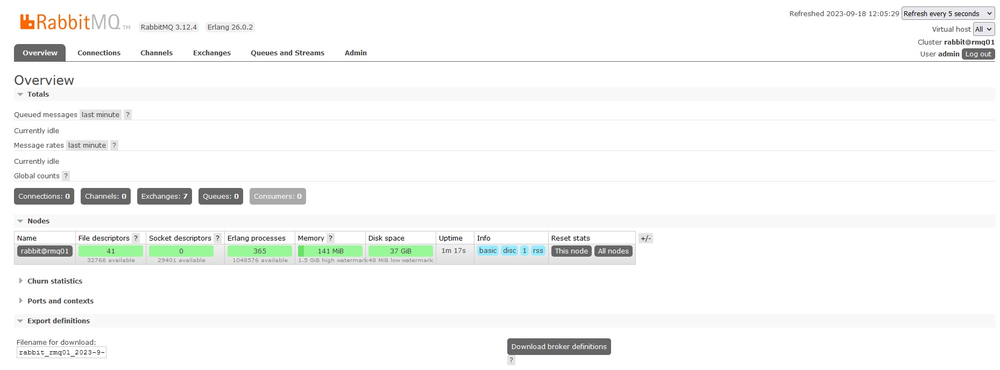
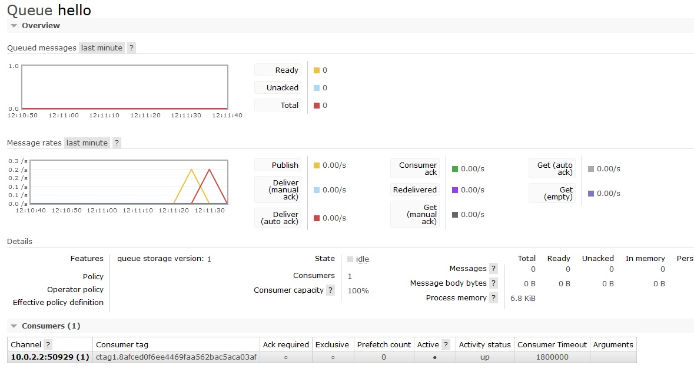
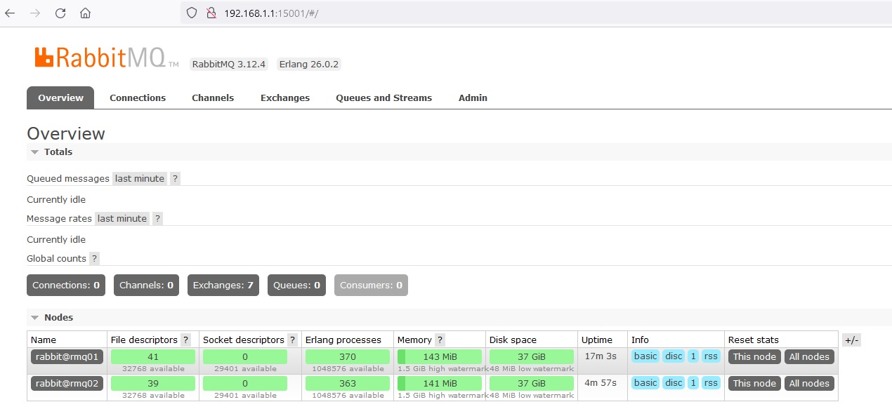
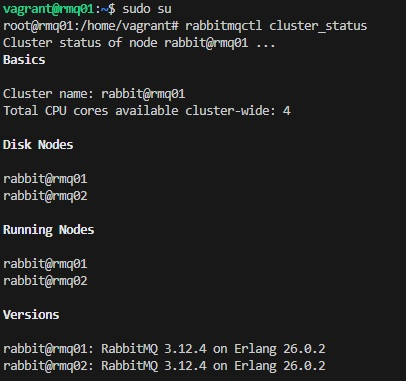
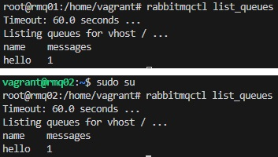

# Очереди RabbitMQ
## Домашнее задание. Горбунов Владимир

## Содержание
- [Задание 1. Web interface](#задание-1-установка-rabbitmq)
- [Задание 2. Test queue ](#задание-2-отправка-и-получение-сообщений)  
- [Задание 3. HA cluster ](#задание-3-подготовка-ha-кластера)

### Задание 1 Установка RabbitMQ

```
Используя Vagrant или VirtualBox, создайте виртуальную машину и установите RabbitMQ.
Добавьте management plug-in и зайдите в веб-интерфейс.
*Итогом выполнения домашнего задания будет приложенный скриншот веб-интерфейса RabbitMQ.*
```
Включение веб-интерфейса:
```
rabbitmq-plugins enable rabbitmq_management
systemctl start rabbitmq-server

```



### Задание 2 Отправка и получение сообщений

```
Используя приложенные скрипты, проведите тестовую отправку и получение сообщения.
Для отправки сообщений необходимо запустить скрипт producer.py.  
Для работы скриптов вам необходимо установить Python версии 3 и библиотеку Pika.
Также в скриптах нужно указать IP-адрес машины, на которой запущен RabbitMQ, заменив localhost на нужный IP.
$ pip install pika  
Зайдите в веб-интерфейс, найдите очередь под названием hello и сделайте скриншот.
После чего запустите второй скрипт consumer.py и сделайте скриншот результата выполнения скрипта  
*В качестве решения домашнего задания приложите оба скриншота, сделанных на этапе выполнения.*  
Для закрепления материала можете попробовать модифицировать скрипты, чтобы поменять название очереди и отправляемое сообщение.
```
- Скрипты Python для работы с Rabbit: [./producer.py](./producer.py) [./consumer.py](./consumer.py)  
- Работа скриптов:  
  
- Состоянии очереди в GUI:  
    


### Задание 3 Подготовка HA кластера

```
Используя Vagrant или VirtualBox, создайте вторую виртуальную машину и установите RabbitMQ.
Добавьте в файл hosts название и IP-адрес каждой машины, чтобы машины могли видеть друг друга по имени.

Пример содержимого hosts файла:
$ cat /etc/hosts
192.168.0.10 rmq01
192.168.0.11 rmq02

После этого ваши машины могут пинговаться по имени.

Затем объедините две машины в кластер и создайте политику ha-all на все очереди.

*В качестве решения домашнего задания приложите скриншоты из веб-интерфейса с информацией о доступных нодах в кластере и включённой политикой.*
Также приложите вывод команды с двух нод:

$ rabbitmqctl cluster_status

Для закрепления материала снова запустите скрипт producer.py и приложите скриншот выполнения команды на каждой из нод:

$ rabbitmqadmin get queue='hello'

После чего попробуйте отключить одну из нод, желательно ту, к которой подключались из скрипта, затем поправьте параметры подключения в скрипте consumer.py на вторую ноду и запустите его.

*Приложите скриншот результата работы второго скрипта.*
```
- ВМ создаются на локальной машине с помощью Vagrant.
  - Прокидываются порты для GUI(15672) и AMQP(5672) на хостовую машину
  - На хостовой машине Windows, поэтому провижн с помощью Ansible работает некорректно. Вагрантом запускается провижн скрипт для установки RabbitMQ [./rabbitmqserver.sh](./rabbitmqserver.sh) (в скрипте - команды из документации Rabbit)
  - Дополнительно скриптом создаётся пользователь admin и ему даются права, чтобы можно было заходить в GUI с хостовой машины
```
rabbitmqctl add_user admin admin
rabbitmqctl set_permissions -p / admin ".*" ".*" ".*"
rabbitmqctl set_user_tags admin administrator

```  
  - Вагрантом же в каждом хосте дописываются необходимые строчки в /etc/hosts
  - [./vagrantfile](./vagrantfile)
  - Далее на хостовой машине две команды:  
Читаем куки с первой ноды:  
`vagrant ssh rmq01 -c 'sudo cat /var/lib/rabbitmq/.erlang.cookie'`  
Записываем на вторую, рестарт и подключение к кластеру:  
`vagrant ssh rmq02 -c 'echo "SVDWSERLTYSXPXUWJHPK" | sudo tee /var/lib/rabbitmq/.erlang.cookie && sudo systemctl restart rabbitmq-server && sudo rabbitmqctl stop_app && sudo rabbitmqctl join_cluster rabbit@rmq01 && sudo rabbitmqctl start_app'`  

- Состояние кластера:  
  
  
- Отправка сообщения на первую ноду, проверка очереди на обеих ВМ:  

- Отключаю первую ноду, получаю сообщение со второй:
