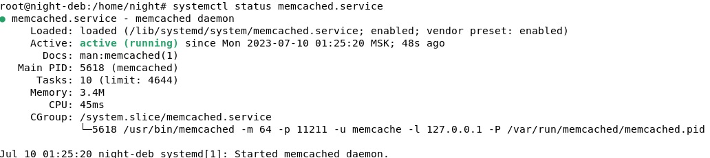
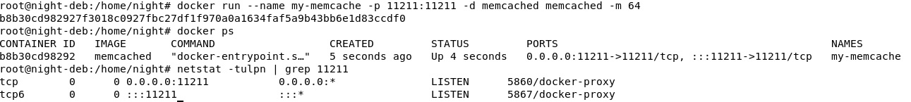
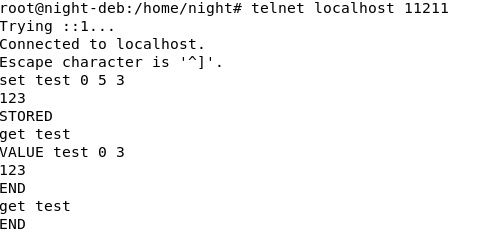
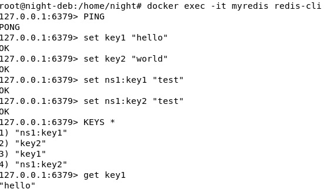
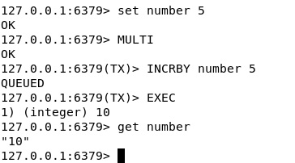

# Кеширование Redis/memcached
## Домашнее задание. Горбунов Владимир

## Задание 1. Кеширование 
> Приведите примеры проблем, которые может решить кеширование. 
- Медленная обработка запросов к основной БД
- Периодическая пиковая нагрузка, когда БД перестает отвечать из-за большого количества запросов
- Длительное время доступа к данным из-за обращения к диску. Кэш работает из оперативной памяти
## Задание 2. Memcached
>Установите и запустите memcached.  
*Приведите скриншот systemctl status memcached, где будет видно, что memcached запущен.*

- Запуск в качестве демона

- Запуск в контейнере

## Задание 3. Удаление по TTL в Memcached
> Запишите в memcached несколько ключей с любыми именами и значениями, для которых выставлен TTL 5.  
*Приведите скриншот, на котором видно, что спустя 5 секунд ключи удалились из базы.*

## Задание 4. Запись данных в Redis
> Запишите в Redis несколько ключей с любыми именами и значениями.   
*Через redis-cli достаньте все записанные ключи и значения из базы, приведите скриншот этой операции.*

## Задание 5*. Работа с числами 
>Запишите в Redis ключ key5 со значением типа "int" равным числу 5. Увеличьте его на 5, чтобы в итоге в значении лежало число 10.    
*Приведите скриншот, где будут проделаны все операции и будет видно, что значение key5 стало равно 10.*

