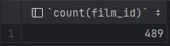
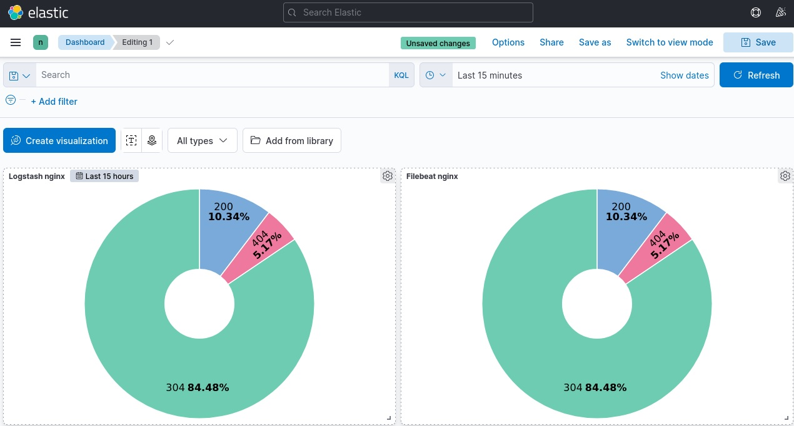

# ELK
## Домашнее задание. Горбунов Владимир

## Содержание

- [Задание 1. Elasticsearch](#Задание-1-Elasticsearch)
- [Задание 2. Kibana](#Задание-2-Kibana)  
- [Задание 3. Logstash](#Задание-3-Logstash) 
- [Задание 4. Filebeat](#Задание-4-Filebeat)  

## Дополнительные ресурсы
При выполнении задания используйте дополнительные ресурсы:
- [поднимаем elk в docker](https://www.elastic.co/guide/en/elasticsearch/reference/7.17/docker.html);
- [поднимаем elk в docker с filebeat и docker-логами](https://www.sarulabs.com/post/5/2019-08-12/sending-docker-logs-to-elasticsearch-and-kibana-with-filebeat.html);
- [конфигурируем logstash](https://www.elastic.co/guide/en/logstash/7.17/configuration.html);
- [плагины filter для logstash](https://www.elastic.co/guide/en/logstash/current/filter-plugins.html);
- [конфигурируем filebeat](https://www.elastic.co/guide/en/beats/libbeat/5.3/config-file-format.html);
- [привязываем индексы из elastic в kibana](https://www.elastic.co/guide/en/kibana/7.17/index-patterns.html);
- [как просматривать логи в kibana](https://www.elastic.co/guide/en/kibana/current/discover.html);
- [решение ошибки increase vm.max_map_count elasticsearch](https://stackoverflow.com/questions/42889241/how-to-increase-vm-max-map-count).

## Итоговый сетап в docker compose:
[docker-compose.yaml](./docker-compose.yaml)  - запуск Elasticsearch, Kibana, Filebeat, Metricbeat, Logstash  
[filebeat.yml](./filebeat.yml) - конфигурация Filebeat с учетом мониторинга Metricbeat  
[fb-nginx.yml](./fb-nginx.yml) - модуль Filebeat для nginx  
[logstash.conf](./logstash.conf) - конфигурация Logstash  
[metricbeat.yml](./metricbeat.yml) - мониторинг всех компонентов и хоста  
Версия elasticsearch, kibana и всех остальных программ - 7.17.9

Дополнительно помимо основной части задания, подлючен мониторинг кластера метрикбитом:


## Задание 1. Elasticsearch
> Установите и запустите Elasticsearch, после чего поменяйте параметр cluster_name на случайный.   
*Приведите скриншот команды 'curl -X GET 'localhost:9200/_cluster/health?pretty', сделанной на сервере с установленным Elasticsearch. Где будет виден нестандартный cluster_name*.


Cluster_name передаётся в переменных окружения докер компоузом
```
    environment:
      - xpack.security.enabled=false
      - discovery.type=single-node
      - cluster.name=my-cluster
```
В докер компоуз добавлен мониторинг состояния эластика:
```
    healthcheck:
      test: curl -s http://elasticsearch:9200/_cluster/health?pretty | grep -q -e 'green' -e 'yellow'
      interval: 10s
      timeout: 10s
      retries: 50
```
## Задание 2. Kibana
> Установите и запустите Kibana.  
*Приведите скриншот интерфейса Kibana на странице http://<ip вашего сервера>:5601/app/dev_tools#/console, где будет выполнен запрос GET /_cluster/health?pretty*.


В докер компоуз добавлен мониторинг доступности кибаны:
```
    healthcheck:
     test: curl -s -I  http://kibana:5601/app/home | grep -q 'HTTP/1.1 200 OK'
     interval: 10s
     timeout: 10s
     retries: 50  
```
## Задание 3. Logstash
> Установите и запустите Logstash и Nginx. С помощью Logstash отправьте access-лог Nginx в Elasticsearch.  
*Приведите скриншот интерфейса Kibana, на котором видны логи Nginx.*

Решил сделать следующим образом:  
На хосте монтируется папка /projects/test/ingest_data/ в которую мапятся логи nginx. Эта же папка мапится в контейнеры с логсташем и файлбитом


## Задание 4. Filebeat
> Установите и запустите Filebeat. Переключите поставку логов Nginx с Logstash на Filebeat.  
*Приведите скриншот интерфейса Kibana, на котором видны логи Nginx, которые были отправлены через Filebeat.*

Для обработки логов Nginx решил использовать встроенный модуль  
Конфигурация Filebeat:
```
filebeat.config:
  modules:
    enabled: true
    path: /usr/share/filebeat/modules.d/*.yml 
    reload.enabled: false

setup.kibana:
  host: ${KIBANA_HOSTS}

output.elasticsearch:
  hosts: ${ELASTIC_HOSTS}

http.enabled: true
http.port: 5066
monitoring.enabled: false
monitoring.cluster_uuid: "FzMrNr_fS5eCO250wLtsaw"
http.host: 0.0.0.0
```
Модуль обработки логов nginx:
```
- module: nginx

  access:
    enabled: true
    var.paths: 
      - '/usr/share/filebeat/ingest_data/access.log'

  error:
    enabled: false

  ingress_controller:
    enabled: false
```

