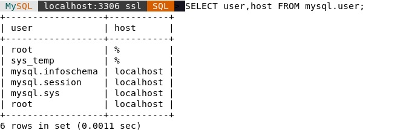
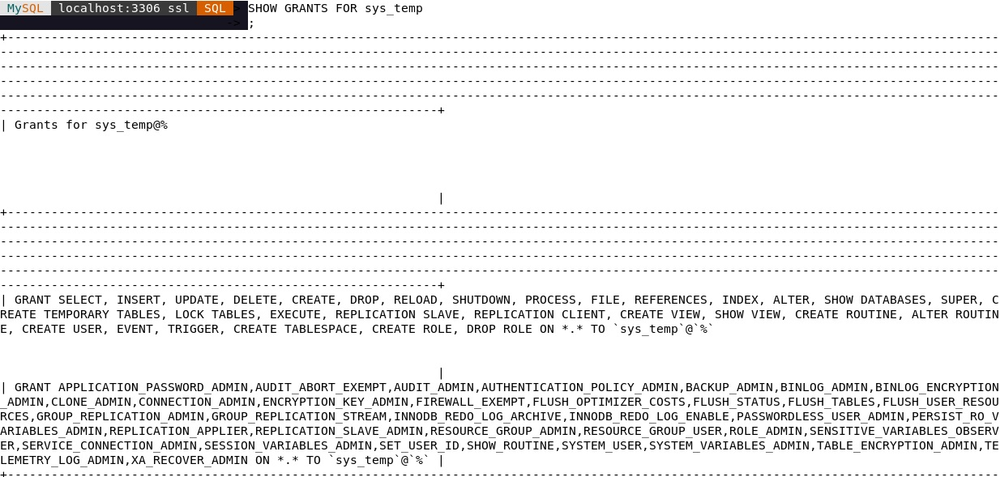
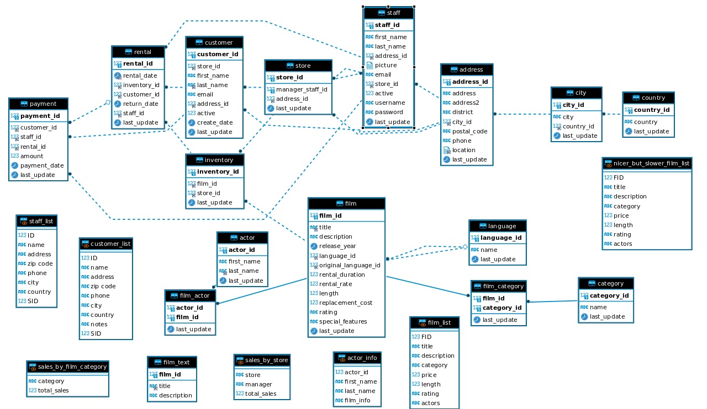
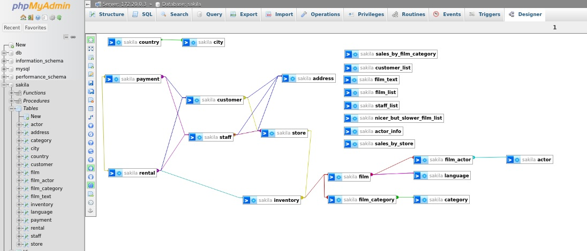
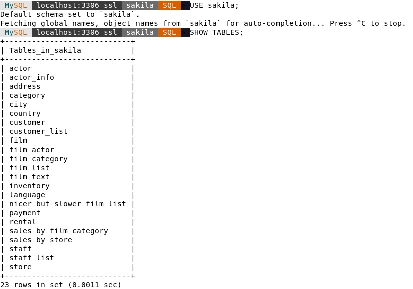
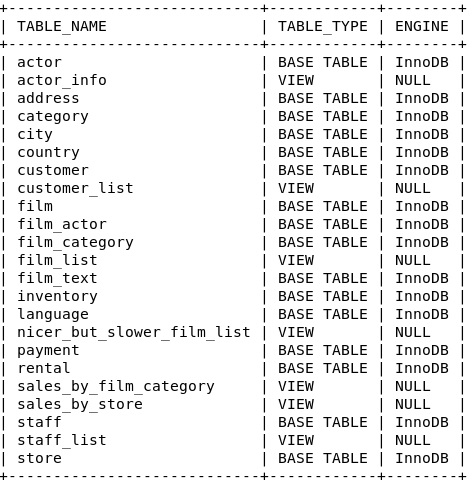

# Работа с данными (DDL/DML)
## Домашнее задание. Горбунов Владимир

## Содержание

- [Задание 1. Работа с MySQL](#задание-1)
- [Задание 2. Список первичных ключей](#задание-2)  
- [Задание 3. Права пользователей](#задание-3)  

>Задание можно выполнить как в любом IDE, так и в командной строке.

### Задание 1
>1.1. Поднимите чистый инстанс MySQL версии 8.0+. Можно использовать локальный сервер или контейнер Docker.  
>1.2. Создайте учётную запись sys_temp.  
>1.3. Выполните запрос на получение списка пользователей в базе данных. (скриншот)  
>1.4. Дайте все права для пользователя sys_temp.  
>1.5. Выполните запрос на получение списка прав для пользователя sys_temp. (скриншот)  
>1.6. Переподключитесь к базе данных от имени sys_temp.  
>Для смены типа аутентификации с sha2 используйте запрос:   
>ALTER USER 'sys_test'@'localhost' IDENTIFIED WITH mysql_native_password BY 'password';  
>1.6. По ссылке https://downloads.mysql.com/docs/sakila-db.zip скачайте дамп базы данных.  
>1.7. Восстановите дамп в базу данных.  
>1.8. При работе в IDE сформируйте ER-диаграмму получившейся базы данных. При работе в командной строке используйте команду для получения всех таблиц базы данных. (скриншот)  
>*Результатом работы должны быть скриншоты обозначенных заданий, а также простыня со всеми запросами.*

- MySQL запускается в [контейнере](./docker-compose.yaml), образ mysql:8.0.34-debian

```bash
mysqlsh -h localhost -u root -P 3306
```
```sql
\option --persist defaultMode sql
\sql
CREATE USER sys_temp IDENTIFIED BY '123';
SELECT user,host FROM mysql.user;
GRANT ALL PRIVILEGES ON *.* TO sys_temp;
SHOW GRANTS FOR sys_temp;
\quit
```
```bash
mysqlsh -h localhost -u sys_temp -P 3306
```
```bash
mysqlsh -h localhost -u sys_temp -P 3306 < ./sakila-db/sakila-schema.sql 
mysqlsh -h localhost -u sys_temp -P 3306 < ./sakila-db/sakila-data.sql 
```

- 1.3 Список пользователей  
  


- 1.5 Список прав пользователя  
 


- 1.8 ER диаграмма в Dbeaver  
 


- 1.8 ER диаграмма phpmyadmin (phpmyadmin запущен в соседнем контейнере докера в одной сети с mysql)  
 


- 1.8 Список таблиц базы данных (CLI)  
 


- 1.8 Список таблиц с типом
```sql
SELECT table_name, table_type, engine
FROM information_schema.tables
WHERE table_schema = 'sakila' ORDER BY table_name;
```
 


### Задание 2
>Составьте таблицу, используя любой текстовый редактор или Excel, в которой должно быть два столбца: в первом должны быть названия таблиц восстановленной базы, во втором названия первичных ключей этих таблиц. Пример: (скриншот/текст)  
>Название таблицы | Название первичного ключа  
>customer         | customer_id  

```sql
select tab.table_schema as database_schema,
    sta.index_name as pk_name,
    sta.seq_in_index as column_id,
    sta.column_name,
    tab.table_name
from information_schema.tables as tab
inner join information_schema.statistics as sta
        on sta.table_schema = tab.table_schema
        and sta.table_name = tab.table_name
        and sta.index_name = 'primary'
where tab.table_schema = 'sakila'
    and tab.table_type = 'BASE TABLE'
order by tab.table_name,
    column_id;
```
 

### Задание 3
>3.1. Уберите у пользователя sys_temp права на внесение, изменение и удаление данных из базы sakila.  
>3.2. Выполните запрос на получение списка прав для пользователя sys_temp. (скриншот)  
>*Результатом работы должны быть скриншоты обозначенных заданий, а также простыня со всеми запросами.*  
 