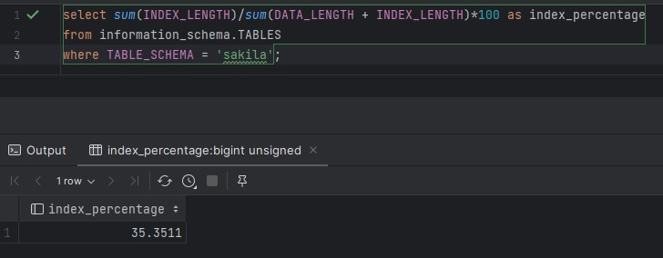
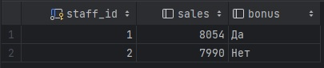

# SQL. Часть 2
## Домашнее задание. Горбунов Владимир

## Содержание

- [Задание 1](#задание-1)
- [Задание 2](#задание-2)  
- [Задание 3](#задание-3)  
- [Задание 4](#задание-4)
- [Задание 5](#задание-5)  

>Задание выполняется на учебной базе MySQL https://downloads.mysql.com/docs/sakila-db.zip 
>Задание можно выполнить как в любом IDE, так и в командной строке.

### Задание 1

>Одним запросом получите информацию о магазине, в котором обслуживается более 300 покупателей, и выведите в результат следующую информацию: 
>- фамилия и имя сотрудника из этого магазина;
>- город нахождения магазина;
>- количество пользователей, закреплённых в этом магазине.
```sql
select concat(staff.last_name, ' ' ,staff.first_name) as staff_member, city.city as store_address,  count(customer_id) as num_of_customers
from store
join customer on store.store_id = customer.store_id
join address on store.address_id = address.address_id
join city on address.city_id = city.city_id
join staff on store.store_id = staff.store_id
group by staff.staff_id, city.city_id
having num_of_customers > 300;
```
  


### Задание 2
>Получите количество фильмов, продолжительность которых больше средней продолжительности всех фильмов.
```sql
select count(film_id)
from film
where film.length >
      (select avg(film.length)
       from film);
```


### Задание 3
>Получите информацию, за какой месяц была получена наибольшая сумма платежей, и добавьте информацию по количеству аренд за этот месяц.
```sql
select month(payment.payment_date) as month, count(payment.payment_id) as payments,  sum(payment.amount) as sum
from payment
group by month(payment.payment_date)
order by sum(payment.amount) desc
limit 1;
```


### Задание 4
>Посчитайте количество продаж, выполненных каждым продавцом. Добавьте вычисляемую колонку «Премия». Если количество продаж превышает 8000, то значение в колонке будет «Да», иначе должно быть значение «Нет».
```sql
select staff.staff_id, count(payment.payment_id) as sales,
       case
           when count(payment.payment_id) > 8000 THEN 'Да'
           else 'Нет'
       END AS bonus
from staff
join payment on staff.staff_id = payment.staff_id
group by staff.staff_id;
```


### Задание 5
>Найдите фильмы, которые ни разу не брали в аренду.
```sql
select film.title
from film
left join inventory on film.film_id = inventory.film_id
left join rental on inventory.inventory_id = rental.inventory_id
where rental.inventory_id is null
```
