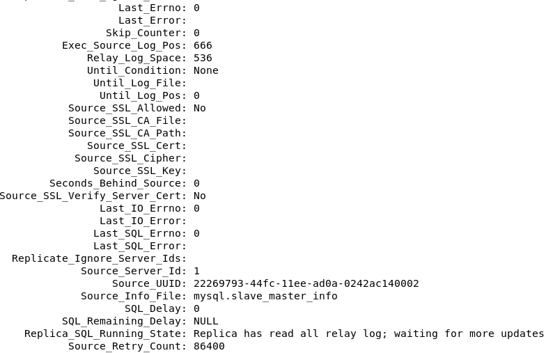

# SQL. Индексы
## Домашнее задание. Горбунов Владимир

## Содержание

- [Задание 1](#задание-1)
- [Задание 2](#задание-2)  
- [Задание 3](#задание-3)  


>Задание выполняется на учебной базе MySQL https://downloads.mysql.com/docs/sakila-db.zip 
>Задание можно выполнить как в любом IDE, так и в командной строке.

### Задание 1

>Напишите запрос к учебной базе данных, который вернёт процентное отношение общего размера всех индексов к общему размеру всех таблиц.

Общий размер всех таблиц - размер данных + размер индексов, поэтому:
```sql
SELECT sum(INDEX_LENGTH)/sum(DATA_LENGTH + INDEX_LENGTH)*100 as index_percentage
FROM information_schema.TABLES
WHERE TABLE_SCHEMA = 'sakila';
```


### Задание 2
>Выполните explain analyze следующего запроса:  

> select distinct concat(c.last_name, ' ', c.first_name), sum(p.amount) over (partition by c.customer_id, f.title)  
from payment p, rental r, customer c, inventory i, film f  
where date(p.payment_date) = '2005-07-30' and p.payment_date = r.rental_date and r.customer_id = c.customer_id and i.inventory_id = r.inventory_id  

>перечислите узкие места;  
>оптимизируйте запрос: внесите корректировки по использованию операторов, при необходимости добавьте индексы.  

- Explain analyze:
```
-> Table scan on <temporary>  (cost=2.5..2.5 rows=0) (actual time=4170..4170 rows=391 loops=1)
    -> Temporary table with deduplication  (cost=0..0 rows=0) (actual time=4170..4170 rows=391 loops=1)
        -> Window aggregate with buffering: sum(payment.amount) OVER (PARTITION BY c.customer_id,f.title )   (actual time=1856..4023 rows=642000 loops=1)
            -> Sort: c.customer_id, f.title  (actual time=1856..1913 rows=642000 loops=1)
                -> Stream results  (cost=10.1e+6 rows=15.6e+6) (actual time=0.364..1213 rows=642000 loops=1)
                    -> Nested loop inner join  (cost=10.1e+6 rows=15.6e+6) (actual time=0.359..1038 rows=642000 loops=1)
                        -> Nested loop inner join  (cost=8.51e+6 rows=15.6e+6) (actual time=0.357..914 rows=642000 loops=1)
                            -> Nested loop inner join  (cost=6.95e+6 rows=15.6e+6) (actual time=0.353..777 rows=642000 loops=1)
                                -> Inner hash join (no condition)  (cost=1.54e+6 rows=15.4e+6) (actual time=0.344..40.4 rows=634000 loops=1)
                                    -> Filter: (cast(p.payment_date as date) = '2005-07-30')  (cost=1.61 rows=15400) (actual time=0.0306..5.11 rows=634 loops=1)
                                        -> Table scan on p  (cost=1.61 rows=15400) (actual time=0.0233..3.11 rows=16044 loops=1)
                                    -> Hash
                                        -> Covering index scan on f using idx_title  (cost=112 rows=1000) (actual time=0.106..0.247 rows=1000 loops=1)
                                -> Covering index lookup on r using rental_date (rental_date=p.payment_date)  (cost=0.25 rows=1.01) (actual time=735e-6..0.00106 rows=1.01 loops=634000)
                            -> Single-row index lookup on c using PRIMARY (customer_id=r.customer_id)  (cost=250e-6 rows=1) (actual time=95.1e-6..113e-6 rows=1 loops=642000)
                        -> Single-row covering index lookup on i using PRIMARY (inventory_id=r.inventory_id)  (cost=250e-6 rows=1) (actual time=78.5e-6..96.2e-6 rows=1 loops=642000)

```
Бросается в глаза количество строк, которые необходимо просканировать, чтобы выполнить запрос.  
Оконная функция сканирует таблицу с 642000 строк.
А сама таблица при объединении и выборке по предварительным рассчётам explain analyze должна сканировать 15,4*10^6 строк, а фактически - 642000.
Это происходит из-за того, что таблица film присоединяется кросс-джойном, соответственно таблицы перемножаются. 

1. Если изначальной задачей было посмотреть данные по каждому пользователю на определенную дату (2005-07-30) и какие фильмы на какую сумму он оплатил, то можно переписать запрос следующим образом:

```sql
select concat(c.last_name, ' ', c.first_name), f.title, sum(p.amount) over (partition by c.customer_id, f.title)
from payment p, rental r, customer c, inventory i, film f
where date(p.payment_date) = '2005-07-30' and p.payment_date = r.rental_date and r.customer_id = c.customer_id and i.inventory_id = r.inventory_id and i.film_id = f.film_id
```
Добавив поле с названием фильма f.title, и указав условие по которому добавляется таблица film i.film_id = f.film_id  
В этом случае получаем такую выборку:  
  
Время выполнения запроса (согласно explain analyze) сокращается с 3741 до 7, а фактическое в IDE с 3с до 38мс.


2. Если всё-таки задача - получить данные по количеству оплат от каждого пользователя в конкретный день (что и происходит при выполнении изначального запроса), то таблицы film и inventory вообще не нужны. 
Кроме того, логичнее и нагляднее все необходимые таблицы присоединить джойнами. 
```sql
select distinct concat(c.last_name, ' ', c.first_name), sum(p.amount) over (partition by c.customer_id)
from payment p
join rental r on r.rental_date = p.payment_date
join customer c on r.customer_id = c.customer_id
where date(p.payment_date) = '2005-07-30'
```
Время выполнения запроса (согласно explain analyze) 5.51, а фактическое в IDE 31 мс


- При дальнейшей оптимизации можно добавить индексы для first name (last name и так проиндексировано)
```
alter table customer
add index idx_first_name(first_name)
```
Время выполнения запроса (согласно explain analyze) 5.39, а фактическое в IDE 29 мс


- Если к базе часто поступают запросы в которых используется фильтр по date(p.payment_date),
то имеет смысл выделить поле payment_date_only. Но естественно это нужно учесть при дальнейшем внесении / изменении записей в БД. 
Это актуально именно в случае MySQL, постгрес может создавать индексы по выражениям. 
```sql
ALTER TABLE payment
ADD COLUMN payment_date_only DATE;

UPDATE payment
SET payment_date_only = DATE(payment_date);

CREATE INDEX date_payment_date_index
ON payment (payment_date_only);
```
Сам запрос:
```sql
select distinct concat(c.last_name, ' ', c.first_name), sum(p.amount) over (partition by c.customer_id)
from payment p
join rental r on r.rental_date = p.payment_date
join customer c on r.customer_id = c.customer_id
where p.payment_date_only = '2005-07-30'
```
Время выполнения запроса (согласно explain analyze) 2.65 (в два раза меньше)

- И оконная функция тут не нужна, она добавляет лишние вычисления. Для каждой оплаты (т.к. мы начинаем строить с таблицы payments) подсчитывается общая сумма по покупателю, а потом лишние убираются (distinct)
```sql
select  concat(c.last_name, ' ', c.first_name), sum(p.amount)
from payment p
join rental r on r.rental_date = p.payment_date
join customer c on r.customer_id = c.customer_id
where p.payment_date_only = '2005-07-30'
group by concat(c.last_name, ' ', c.first_name)
```
Время выполнения запроса (согласно explain analyze) 1.94 


### Задание 3
>Самостоятельно изучите, какие типы индексов используются в PostgreSQL. Перечислите те индексы, которые используются в PostgreSQL, а в MySQL — нет.


- Частичные индексы (Partial index) Индексы на основе условия.
- Индекс на основе выражения (как раз то, что могло бы пригодиться во втором задании)
- Bitmap indexes  
Postgres может использовать результаты поиска по нескольким индексам, создавая в оперативной памяти битовую карту блоков с подходящими записями, а затем применяя к ним операторы «или» либо «и». В результате остаются только блоки, удовлетворяющие всем критериям поиска, и PostgreSQL считывает все записи в этих блоках, чтобы перепроверить условия поиска.
- GiST (Generalized Search Tree)  
GiST индексирует точки. Условия поиска выражаются прямоугольником: возвращаются все точки, находящиеся внутри этого прямоугольника.
Если говорить точнее, GiST – это семейство индексных структур, каждая из которых поддерживает определенный тип данных. В дистрибутив PostgreSQL
включена поддержка точек; некоторые другие типы данных могут быть установлены как расширения.
Aтрибуты, включаемые в индекс GiST, не обязательно должны быть координатами. Такие атрибуты могут представлять время или другие
упорядоченные типы данных.
    - SP-GiST (Space-partitioned Generalized Search Tree)  
Разбиение области значений на неперекрывающиеся подобласти, каждая из которых, в свою очередь, также может быть разбита.
- BRIN (Block Range INdexes)  
Предназначен для индексации больших таблиц.
Таблица, для которой создается индекс BRIN, рассматривается как последовательность зон, где каждая зона состоит из фиксированного числа смежных
блоков. Для каждой зоны запись индекса BRIN содержит сводку значений, находящихся в этой зоне. Например, сводка может содержать минимальное
и максимальное значения столбца временной отметки в таблице журнала событий.
- GIN (Generalized Inverted Index)  
В целях индексации документ рассматривается как список фрагментов и представляется значением типа данных tsvector (при преобразовании данных в tsvector Postgres разбирает текстовый документ на токены, сводит токены к лексемам и возвращает tsvector, в котором перечислены лексемы с указанием их позиций в документе). Для каждого фрагмента, содержащегося хотя бы в одном документе, инвертированный индекс содержит список документов, содержащих этот фрагмент