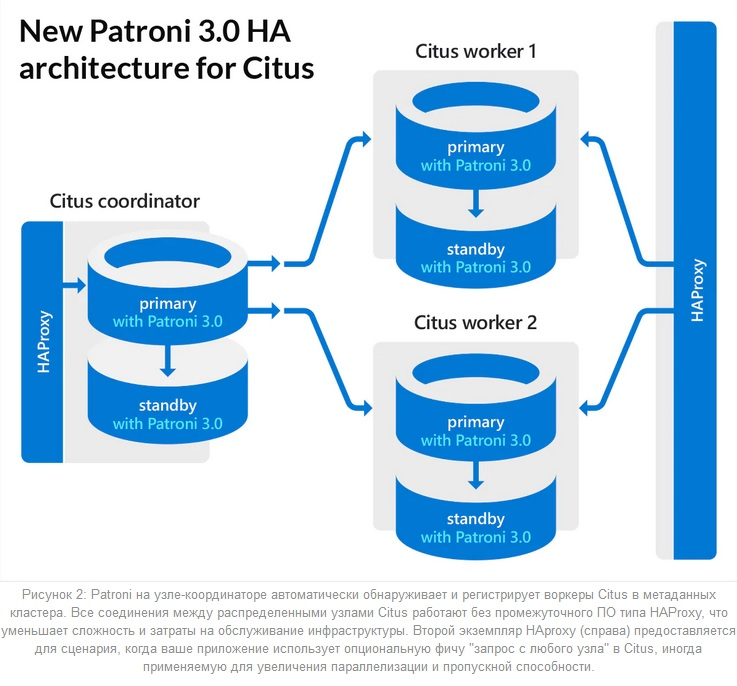

# SQL. Резервное копирование баз данных
## Домашнее задание. Горбунов Владимир

## Содержание

- [Задание 1. Резервное копирование](#задание-1)
- [Задание 2. Postgres](#задание-2)  
- [Задание 3. MySQL](#задание-3)  

### Задание 1 
```
Кейс
Финансовая компания решила увеличить надёжность работы баз данных и их резервного копирования.
Необходимо описать, какие варианты резервного копирования подходят в случаях:
1.1. Необходимо восстанавливать данные в полном объёме за предыдущий день.
1.2. Необходимо восстанавливать данные за час до предполагаемой поломки.
1.3.* Возможен ли кейс, когда при поломке базы происходило моментальное переключение на работающую или починенную базу данных.
Приведите ответ в свободной форме.
```
- В первом случае можно  использовать инкрементный бэкап. Например, делать полный бэкап раз в неделю и инкрементный каждый день. Скорость восстановления базы с такого бэкаа будет ниже, т.к. необходимо будет просуммировать все дельты за неделю, но в целом мне кажется это приемлемым вариантом
- Во втором случае наверно лучше настроить дифференцированный бэкап. Полный бэкап раз в день и почасовой дифференцированный. Из минусов - он накопительный, поэтому будут избыточные данные, необходимо будет больше места на диске. Из плюсов - более быстрое восстановление, т.к. нужен только суточный полный + дифференцированный на нужный момент.
- Да, возможен, организация кластера базы данных в различных комбинациях. 
  - В самом простом случае конфигурация мастер-слейв, когда слейв используется как бэкап и вводится в систему только в случае падения мастера, например при помощи Keepalived и скриптов на проверку состояния мастера и изменения конфигурации слейва на мастер.
  - Организация кластера баз данных. Например, Patroni+Citus для горизонтального масштабирования и быстрого переключения между мастером и репликой.
   

### Задание 2
```
2.1. С помощью официальной документации приведите пример команды резервирования данных и восстановления БД (pgdump/pgrestore).
2.1.* Возможно ли автоматизировать этот процесс? Если да, то как?
Приведите ответ в свободной форме.
```
- pg_dump mydb > db.sql
```
pg_dump [connection-option...] [option...] [dbname]
```
- pg_restore -C -d postgres db.dump  
  в данном примере postgres - название любой существующей бд. Т.к. команда выполняется с ключом -С будет создана новая бд по названию передаваемого файла
```sql
pg_restore [connection-option...] [option...] [filename]
```
- Автоматизировать в самом простом случае с помощью скрипта и помещения его в кронтаб.

```bash
# ~/pg_backup.sh
db_name=dbname
db_user=dbuser
db_host=host
backupfolder=~/postgresql/backups 
recipient_email=youremail@example.ru
# Сколько дней хранить файлы
keep_day=30
sqlfile=$backupfolder/database-$(date +%d-%m-%Y_%H-%M-%S).sql
zipfile=$backupfolder/database-$(date +%d-%m-%Y_%H-%M-%S).zip
mkdir -p $backupfolder

if pg_dump -U $db_user -h $db_host $db_name > $sqlfile ; then
   echo 'Sql dump created'
else
   echo 'pg_dump return non-zero code' 
   exit
fi

if gzip -c $sqlfile > $zipfile; then
   echo 'The backup was successfully compressed'
else
   echo 'Error compressing backup' 
   exit
fi
rm $sqlfile 
echo $zipfile 
 
find $backupfolder -mtime +$keep_day -delete
```

Дополнительно создаём в домашней директории пользователя .pgpass, чтобы pgdump не запрашивал каждый раз пароль

Добавляем скрипт в кронтаб


- С помощью сторонних инструментов. Например, специально для постгреса - Barman. Или, например, есть соответствующий плагин для Baculа.


### Задание 3
```
3.1. С помощью официальной документации приведите пример команды инкрементного резервного копирования базы данных MySQL.
3.1.* В каких случаях использование реплики будет давать преимущество по сравнению с обычным резервным копированием?
Приведите ответ в свободной форме.
```
- 3.1 Инкрементый (фулл скан) бэкап. LSN определяется по любому последнему бэкапу (можно указать last_full_backup, и, соответственно, получить дифференцированный бэкап) из метаданных сервера (можно указать dir:path, и тогда LSN будет взят из файлов в указанной директории)
```bash
mysqlbackup --defaults-file=/home/dbadmin/my.cnf \
  --incremental --incremental-base=history:last_backup \
  --backup-dir=/home/dbadmin/temp_dir \
  --backup-image=incremental_image1.bi \
   backup-to-image
```
- 3.2 
  - На реплику можно быстро переключиться. При обычном резервном копировании нужно время чтобы восстановить бд из бэкапа
  - Реплика в отличии от бэкапов синхронизирует данные с мастером в режиме реального времени
  - Снижение нагрузки на основной сервер, бэкапы можно делать с реплики.
  - Распределение нагрузки на чтение из базы - часть запросов на чтение можно отправлять на реплику
