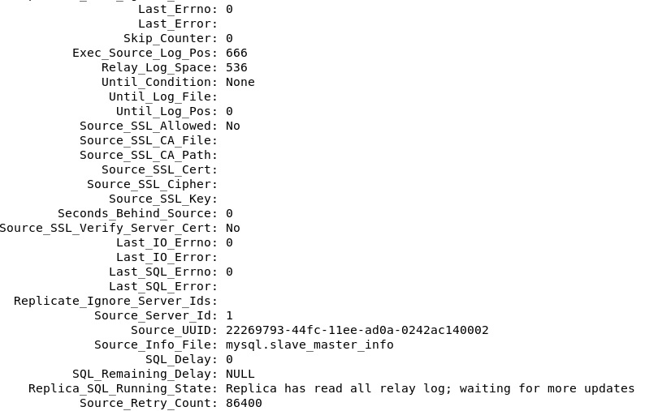
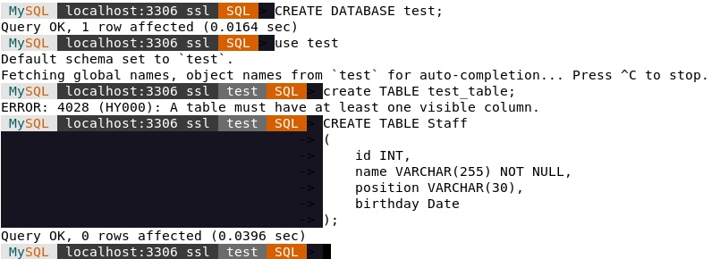
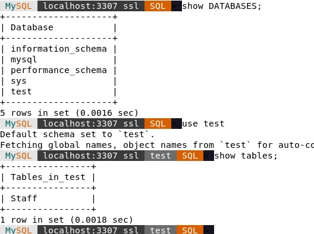
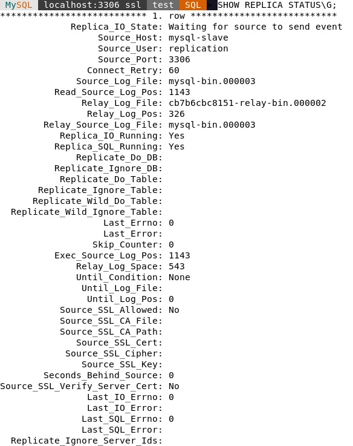
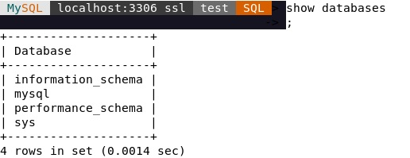

# SQL. Репликация и масштабирование. Часть 1
## Домашнее задание. Горбунов Владимир

## Содержание

- [Задание 1](#задание-1)
- [Задание 2. Настройка master-slave MySQL](#задание-2)  
- [Задание 3. Настройка master-master MySQL](#задание-3)  

### Задание 1
>На лекции рассматривались режимы репликации master-slave, master-master, опишите их различия.

- В режиме Master-Slave новые данные пишутся только на Master, а со Slave они только читаются; в конфигурации Master-Master CRUD операции выполняются на обоих нодах;
- Целостность БД. Master-Slave: после потери и восстановления связи данные с Master будут дописаны в Slave до актуального состояния. Master-Master: после потери и восстановления связи между серверами возникает конфликт и нарушение целостности данных.

Master-master репликация это тот же Master-Slave, только настроенный в обе стороны.  
Как было сказано на лекции, мастер-мастер репликацию в MySQL применяют крайне редко, т.к. её очень легко сломать, и сложно поддерживать в рабочем состоянии.
В случае обрыва связи между двумя мастерами MySQL получаются рассинхронизированные базы данных и репликация ломается. 
 

### Задание 2
>Выполните конфигурацию master-slave репликации, примером можно пользоваться из лекции.
>Приложите скриншоты конфигурации, выполнения работы: состояния и режимы работы серверов.

Запускаю на одной виртуалке с помощью docker compose, оба mysql в одной сети докер:
[docker-compose.yml](./docker-compose.yml)  
Файлы конфигураций [master.cnf](./master.cnf) [slave.cnf](./slave.cnf) монтируются в контейнер.

Проверяем server id (и соответственно нормально ли прочитаны cnf файлы):
```sql
SHOW VARIABLES LIKE 'server_id';
```

На мастере:
```sql
CREATE USER 'replication'@'%' IDENTIFIED WITH mysql_native_password BY 'password';
GRANT REPLICATION SLAVE ON *.* TO 'replication'@'%';
SHOW MASTER STATUS\G
-- *************************** 1. row ***************************
--              File: mysql-bin.000003
--          Position: 666
--      Binlog_Do_DB: 
--  Binlog_Ignore_DB: 
-- Executed_Gtid_Set: 
-- 1 row in set (0.0013 sec)
```

На слейве:
```sql
CHANGE REPLICATION SOURCE TO
SOURCE_HOST='mysql-master',
SOURCE_USER='replication',
SOURCE_PASSWORD='password',
SOURCE_LOG_FILE='mysql-bin.000003',
SOURCE_LOG_POS=666;

START REPLICA;

SHOW REPLICA STATUS\G;
```

Проверяем есть ли ошибки:  


Пробуем создать таблицу на мастере (порт 3306):  


Проверяем на слейве (порт 3307):  



### Задание 3
>Выполните конфигурацию master-master репликации. Произведите проверку.
>Приложите скриншоты конфигурации, выполнения работы: состояния и режимы работы серверов.

Для настройки мастер-мастер проделываем зеркально все действия из второго задания.
На бывшем слейве создаем юзера, читаем файл и позицию, на мастере подключаем. 
```sql
-- *************************** 1. row ***************************
--              File: mysql-bin.000003
--          Position: 1143
--      Binlog_Do_DB: 
--  Binlog_Ignore_DB: 
-- Executed_Gtid_Set: 
-- 1 row in set (0.0051 sec)
CHANGE REPLICATION SOURCE TO
SOURCE_HOST='mysql-slave',
SOURCE_USER='replication',
SOURCE_PASSWORD='password',
SOURCE_LOG_FILE='mysql-bin.000003',
SOURCE_LOG_POS=1143;

START REPLICA;

SHOW REPLICA STATUS\G;
```  

  

Удаляем тестовую базу на бывшем слейве (порт 3307):  
  

Проверяем на исходном мастере (порт 3306):  
