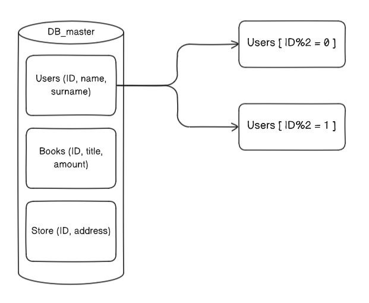
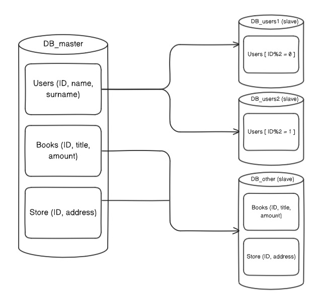

# SQL. Репликация и масштабирование. Часть 2
## Домашнее задание. Горбунов Владимир

## Содержание

- [Задание 1. Механизмы масштабирования](#задание-1)
- [Задание 2. Пример шардинга БД](#задание-2)  
- [Задание 3. Пример в Postgres](#задание-3)  

### Задание 1
```
Опишите основные преимущества использования масштабирования методами:
- активный master-сервер и пассивный репликационный slave-сервер; 
- master-сервер и несколько slave-серверов;
- активный сервер со специальным механизмом репликации — distributed replicated block device (DRBD);
- SAN-кластер.
*Дайте ответ в свободной форме.*
```
 - В первых двух случаях речь идёт в большей степени именно о масштабировании БД. Конфигурация  мастер-слейв позволяет значительно повысить скорость чтения из бд и оптимизировать её использование, можно балансировать нагрузку между слейвами, в случае выхода из строя мастера, слейв сервер может его заменить. 
 - DRBD и SAN-кластер - это больше про отказоустойчивость на инфраструктурном уровне. 
    - С помощью механизма DRBD сервера поддерживают синхронную или асинхронную репликацию блоков данных между собой, создавая виртуальное блочное устройство. При активации DRBD можно быстро переключиться на реплику в случае сбоя активного сервера.
    - SAN-кластер это сетевое хранилище, к которому СУБД получает доступ. 

В целом все эти методы могут использоваться как по отдельности, так и в различных комбинациях в зависимости от требований к производительности и отказоустойчивости системы. 

### Задание 2

```
Разработайте план для выполнения горизонтального и вертикального шаринга базы данных. База данных состоит из трёх таблиц: 
- пользователи, 
- книги, 
- магазины (столбцы произвольно). 
Опишите принципы построения системы и их разграничение или разбивку между базами данных.
Пришлите блоксхему, где и что будет располагаться. Опишите, в каких режимах будут работать сервера.
```
Предположим, что у нас огромная таблица с пользователями. 
Для оптимизации запросов к базе выполним партиционирование (вертикальный шардинг) большой таблицы с пользователями - распределим их по четным-нечетным ID:


При горизонтальном шардинге - выносим эти таблицы на отдельные инстансы. 
БД работает в режим мастер-слейв. В слейве возможны только операции чтения данных. 



### Задание 3

```
Выполните настройку выбранных методов шардинга из задания 2.
Пришлите конфиг Docker и SQL скрипт с командами для базы данных
```