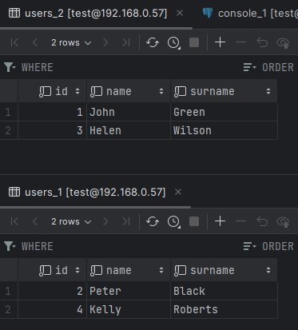
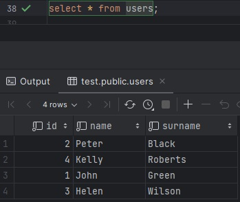
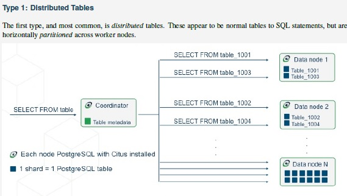
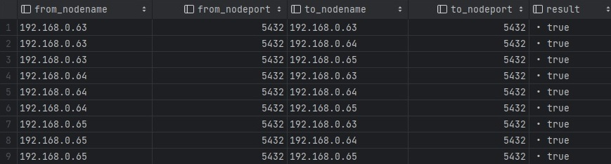

# SQL. Репликация и масштабирование. Часть 2
## Домашнее задание. Горбунов Владимир

## Содержание

- [Задание 1. Механизмы масштабирования](#задание-1)
- [Задание 2. Пример шардинга БД](#задание-2)  
- [Задание 3. Пример в Postgres](#задание-3)  

### Задание 1
```
Опишите основные преимущества использования масштабирования методами:
- активный master-сервер и пассивный репликационный slave-сервер; 
- master-сервер и несколько slave-серверов;
- активный сервер со специальным механизмом репликации — distributed replicated block device (DRBD);
- SAN-кластер.
*Дайте ответ в свободной форме.*
```
 - В первых двух случаях речь идёт в большей степени именно о масштабировании БД. Конфигурация  мастер-слейв позволяет значительно повысить скорость чтения из бд и оптимизировать её использование, можно балансировать нагрузку между слейвами, в случае выхода из строя мастера, слейв сервер может его заменить. 
 - DRBD и SAN-кластер - это больше про отказоустойчивость на инфраструктурном уровне. 
    - С помощью механизма DRBD сервера поддерживают синхронную или асинхронную репликацию блоков данных между собой, создавая виртуальное блочное устройство. При активации DRBD можно быстро переключиться на реплику в случае сбоя активного сервера.
    - SAN-кластер это сетевое хранилище, к которому СУБД получает доступ. 

В целом все эти методы могут использоваться как по отдельности, так и в различных комбинациях в зависимости от требований к производительности и отказоустойчивости системы. 

### Задание 2

```
Разработайте план для выполнения горизонтального и вертикального шаринга базы данных. База данных состоит из трёх таблиц: 
- пользователи, 
- книги, 
- магазины (столбцы произвольно). 
Опишите принципы построения системы и их разграничение или разбивку между базами данных.
Пришлите блоксхему, где и что будет располагаться. Опишите, в каких режимах будут работать сервера.
```
Предположим, что у нас огромная таблица с пользователями. 
- Для оптимизации запросов к базе выполним партицирование (вертикальный шардинг) большой таблицы с пользователями - распределим их по четным-нечетным ID:


- При горизонтальном шардинге - выносим эти таблицы на отдельные инстансы.  
БД работает в режим мастер-слейв.  
В слейве возможны только операции чтения данных. 


### Задание 3

```
Выполните настройку выбранных методов шардинга из задания 2.
Пришлите конфиг Docker и SQL скрипт с командами для базы данных
```

#### 3.1 Партицирование. Вертикальный шардинг. Postgres
- Запускаем pg в контейнере с помощью докер-компоуз [docker-compose.yaml](./docker-compose.yaml)
- Создаём таблицы
<details>
  <summary>SQL запрос</summary> 

```sql
create table users (
    id bigint not null,
    name varchar not null,
    surname varchar not null
);
create table books (
    id bigint not null,
    title varchar not null,
    amount bigint not null
);
create table store (
    id bigint not null,
    address varchar not null
);
```  

</details>

- Создаём таблицы для четных-нечетных ID, которые наследуют у таблицы users

<details>
  <summary>SQL запрос</summary> 

```sql
create table users_1 (
    check ( id%2 = 0 )
) inherits (users);
create table users_2 (
    check ( id%2 = 1 )
) inherits (users);
```

</details>

- Добавляем правила для основной таблицы users на вставку.

<details>
  <summary>SQL запрос</summary> 

```sql
create rule insert_to_users_1 as on insert to users
where (id%2 = 0  )
do instead insert into users_1 values (NEW.*);

create rule insert_to_users_2 as on insert to users
where (id%2 = 1  )
do instead insert into users_2 values (NEW.*) ;
```

</details>

- Вставляем тестовые данные

<details>
  <summary>SQL запрос</summary> 

```sql
INSERT INTO users
(id, name, surname)
VALUES
(1, 'John', 'Green'),
(2, 'Peter', 'Black'),
(3, 'Helen', 'Wilson'),
(4, 'Kelly', 'Roberts');
```
</details>

- Проверяем таблицы.
Как и ожидалось, все пользователи добавились в свои таблицы в соответствии с ID.  

  

- При этом мы можем прочитать все данные из основной таблицы:  

  

- А при запросе ONLY посмотреть, что в ней нет своих данных  
```sql
select * from only users;
```
- При запросах с соответствующим условием **select * from users where id%2=0** постгрес сканирует только нужную таблицу.  

#### 3.2 Горизонтальное шардирование с помощью FDW в Postgres

- В сетапе будет три ноды - главная БД, и две отдельные базы для четных/нечетных пользователей.  
Три контейнера в одной сети докера каждый со своим IP. 
[Docker-compose.yaml](./3.2/docker-compose.yaml)

- на дополнительных нодах создаём таблицы users с соответствующими ограничениями:

<details>
  <summary>SQL запрос</summary> 

```sql
create table users (
    id bigint not null
    constraint id_check check (id%2 = 1),
    name varchar not null,
    surname varchar not null
);
```
</details>

- на основной ноде подключаем расширение FDW и два сервера

<details>
  <summary>SQL запрос</summary> 

```sql
create extension postgres_fdw;

create server users1_server
foreign data wrapper postgres_fdw
options (host '172.20.0.3', port '5432', dbname 'test');

create server users2_server
foreign data wrapper postgres_fdw
options (host '172.20.0.4', port '5432', dbname 'test');

create user mapping for test
server users1_server
options (user 'test', password '123');

create user mapping for test
server users2_server
options (user 'test', password '123');
```
</details>

- подключаем удалённые таблицы которые наследуют у таблицы users

<details>
  <summary>SQL запрос</summary> 

```sql
create foreign table users1 (
    id bigint not null check ( id%2 = 0 ),
    name varchar not null,
    surname varchar not null
    )
inherits (users)
server users1_server
options (schema_name 'public', table_name 'users');

create foreign table users2 (
    id bigint not null check ( id%2 = 1 ),
    name varchar not null,
    surname varchar not null
    )
inherits (users)
server users2_server
options (schema_name 'public', table_name 'users');
```
</details>

- создаём правила 

<details>
  <summary>SQL запрос</summary> 

```sql
create rule insert_to_users_1 as on insert to users
where (id%2 = 0  )
do instead insert into users1 values (NEW.*);
create rule insert_to_users_2 as on insert to users
where (id%2 = 1  )
do instead insert into users2 values (NEW.*);
```
</details>

- по аналогии с пунктом 3.1 - данные вставляются в соответствующие таблицы, которые благодаря механизму FDW теперь расположены на отдельных нодах  
Однако при таком подходе в случае отключения одной из нод таблица будет недоступна и всё поломается.

#### 3.3 Postgres + citus. 

В предыдущем примере получилась неотказоустойчивая система, поэтому решил поэкспериментировать с дополнением Citus для PG    
В докере быстро не получилось подключить citus, поэтому сделал на ВМ Debian.  

Принцип работы распределенных таблиц  


- Установка расширения

<details>
  <summary>Команды</summary> 

```bash
curl https://install.citusdata.com/community/deb.sh | sudo bash
apt-get -y install postgresql-15-citus-12.0
pg_conftool 15 main set shared_preload_libraries citus
pg_conftool 15 main set listen_addresses '*'
+ отредактировать pg_hba.conf для доступа между шардами.
```
```sql
CREATE EXTENSION citus;
```
</details>

- Добавление coordinator и worker нод
  
<details>
  <summary>Команды</summary> 

```sql
SELECT citus_set_coordinator_host('192.168.0.63', 5432);
SELECT * from citus_add_node('192.168.0.64', 5432);
SELECT * from citus_add_node('192.168.0.65', 5432);
```
</details>

- Создание распределенной таблицы users
  
<details>
  <summary>Команды</summary> 

```sql
create table users (
    id bigint not null primary key,
    name varchar not null,
    surname varchar not null
);
SELECT create_distributed_table('users', 'id');
```

</details>

- Проверка работы кластера

<details>
  <summary>Команды</summary> 

```sql
SELECT * FROM pg_dist_node;
```

```sql
SELECT * FROM citus_check_cluster_node_health();
```

</details>